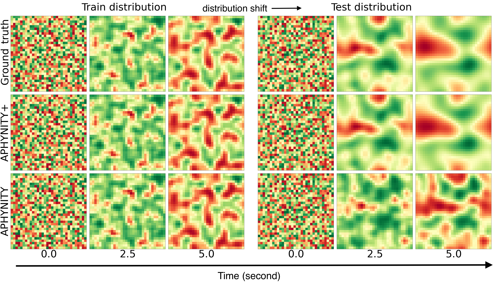

# Robust Hybrid Learning With Expert Augmentation

This repository contains the official implementations of experiments made in the paper ["Robust Hybrid Learning With Expert Augmentation
"](https://openreview.net/forum?id=oe4dl4MCGY) from Antoine Wehenkel, Jens Behrmann, Hsiang Hsu, Guillermo Sapiro, Gilles Louppe, Joern-Henrik Jacobsen.
You can use the following reference to cite our work:
```
@article{wehenkel2023robust,
  title={Robust Hybrid Learning With Expert Augmentation},
  author={Wehenkel, Antoine and Behrmann, Jens and Hsu, Hsiang and Sapiro, Guillermo and Louppe, Gilles and Jacobsen, J{\"o}rn-Henrik},
  journal={Transactions on Machine Learning Research},
  year={2023}
}
```
## Dependencies
You can install dependencies from the files `requirements.txt` and `requirements_pip.txt` as:
```
conda env create -f requirements.txt -n RHL
conda activate RHL
pip install -r requirements_pip.txt
```

To be able to run all commands from the root of the repository you must also execute:
`export PYTHONPATH=.`

## Data generation
Before running any experiments you must generate train, validation and test sets by 
running the `GenerateDataset.py` python code.
For instance to generate data for the Damped Pendulum experiments you would do:

```
python code/data/DampedPendulum/GenerateDataset.py
```

## Double pendulum data

You can get the data of the double pendulum experiments from [this website](https://developer.ibm.com/exchanges/data/all/double-pendulum-chaotic/) and fill in the folder `code/data/DoublePendulum/dpc_dataset_csv` with the data from there.

## Training hybrid learning methods:

You can simply run the `run_experiments.py` file from the `code/scripts` subfolder with the appropriate configuration file.
For instance the configuration file `code/scripts/configs/Pendulum/APHYNITY.yaml` will train an hybrid model with APHYNITY 
on the *Damped Pendulum* data:
```
python code/scripts/run_experiments.py --config code/scripts/configs/Pendulum/APHYNITY.yaml
```

